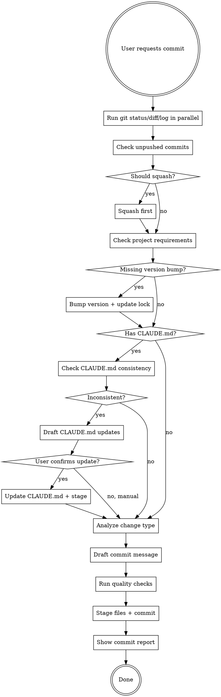

# Commit

## Overview

Structured git commit workflow that enforces project-specific requirements (version bumps, quality checks) and prevents common mistakes (missing files, wrong scope, duplicate commits).

## When to Use

- User says "commit", "提交", or equivalent
- After completing a logical unit of work
- Before switching branches or creating PR

**When NOT to use:**
- Mid-implementation (incomplete feature)
- Tests failing
- Quality checks not passing

## Workflow



## Step-by-Step

### 1. Gather Context (parallel)

```bash
git status
git diff
git log --oneline -10
```

### 2. Check Unpushed Commits

```bash
git log @{u}..HEAD || git log origin/master..HEAD || git log origin/main..HEAD
```

If unpushed commits exist and belong to same logical change → squash before new commit.

### 3. Check Project Requirements

**Common patterns:**
- Version bump required? (check `CLAUDE.md`, `Cargo.toml`, `package.json`, `pyproject.toml`)
- Lock file must be included? (`Cargo.lock`, `package-lock.json`, `uv.lock`)
- Quality checks required? (auto-detect based on project type)

**Quality checks by project type:**
- Rust: `cargo fmt && cargo clippy`
- Python: `uv run ruff format . && uv run ruff check . && uv run basedpyright .`
- JS/TS: `npm run lint` or `bun run lint` (if lint script exists)
- Mixed: run checks for all detected languages

### 3.5. CLAUDE.md Consistency Check

**If project has CLAUDE.md at repo root:**

1. Read current CLAUDE.md content
2. Analyze staged changes (from `git diff --cached`):
   - Look for public interface changes: new/removed/modified functions, classes, types, exports
   - Look for behavior changes: new features, removed features, changed logic
   - Look for architecture changes: new dependencies, service integrations, data flow changes
3. Compare CLAUDE.md description against staged changes:
   - Does CLAUDE.md describe the interfaces/features being added/removed?
   - Does CLAUDE.md reflect the current architecture after these changes?
   - Are there new public APIs that CLAUDE.md doesn't mention?
   - Are there removed features that CLAUDE.md still describes?

**If inconsistency detected:**
- Show specific examples of what's inconsistent (e.g., "CLAUDE.md says vector model loads locally, but code now calls external service")
- Draft suggested CLAUDE.md updates to match the code changes
- Ask user: "CLAUDE.md 需要更新。我已经起草了建议的修改，要我直接更新吗？"
- If user confirms: update CLAUDE.md, stage it, continue commit
- If user declines: explain they should update CLAUDE.md manually before committing

**If consistent or no CLAUDE.md exists:**
- Continue to next step silently

**Bypass:**
- If commit message contains `[skip-claudemd]` tag, skip this check entirely

### 4. Analyze Change Type

Map changes to commit type:
- `feat`: new feature
- `fix`: bug fix
- `refactor`: code restructure, no behavior change
- `perf`: performance improvement
- `test`: test additions/changes
- `docs`: documentation only
- `chore`: maintenance (deps, config, release)
- `style`: formatting, whitespace
- `build`: build system changes
- `ci`: CI/CD changes

### 5. Draft Commit Message

Format: `<type>[optional scope]: <imperative summary>` (max 72 chars)

**Good:**
- `feat: add rate limiting to auth endpoints`
- `fix(parser): handle empty input without panic`
- `chore(release): bump version to v1.2.0`

**Bad:**
- `updated stuff` (vague)
- `Fixed bug` (not imperative, no context)
- `feat: added new feature for handling user authentication with JWT tokens and refresh token rotation` (too long)

Add body (separated by blank line) when WHY isn't obvious from diff.

### 6. Execute Commit

**Auto-detect project type and run appropriate quality checks:**

```bash
# Rust project (has Cargo.toml)
cargo fmt && cargo clippy

# Python project (has pyproject.toml)
uv run ruff format . && uv run ruff check . && uv run basedpyright .

# JS/TS project (has package.json with lint script)
npm run lint  # or bun run lint

# Then commit
git add <specific files>
git commit -m "$(cat <<'EOF'
<commit message>

Co-Authored-By: Claude Opus 4.7 <noreply@anthropic.com>
EOF
)"
```

**Detection logic:**
- Check for `Cargo.toml` → Rust
- Check for `pyproject.toml` → Python
- Check for `package.json` → JS/TS
- Multiple files present → run all applicable checks

### 7. Show Commit Report

After successful commit, display a structured report:

```
✓ 提交完成

提交信息：
  <type>(<scope>): <summary>

已提交文件：
  - path/to/file1.rs
  - path/to/file2.rs
  - Cargo.toml (v0.1.5 → v0.1.6)
  - Cargo.lock

质量检查：
  ✓ cargo fmt passed
  ✓ cargo clippy passed

提交哈希：<short-hash>
```

**Report must include:**
- Commit message (full, including body if present)
- List of committed files with any special notes (version bumps, lock files)
- Quality check results
- Commit hash for reference

## Common Mistakes

| Mistake | Fix |
|---------|-----|
| Commit without checking unpushed commits | Always check `git log @{u}..HEAD` first |
| Forget version bump | Check project `CLAUDE.md` for requirements |
| Commit unrelated changes | Explicitly list files to stage, not `git add .` |
| Skip quality checks | Run project-specific checks before commit |
| Vague commit message | Use conventional commits format with clear summary |
| Commit with failing tests | Verify tests pass before committing |
| Missing commit report | Always show structured report after commit |
| CLAUDE.md out of sync with code | Check CLAUDE.md consistency before commit, update if needed |

## Red Flags

- "I'll commit everything in working tree" → Check if all changes belong together
- "Skip version bump this time" → Project requirements are not optional
- "Commit message: WIP" → Not a logical unit, don't commit yet
- "I'll run tests after committing" → Tests must pass before commit
- "Let me ask user to confirm first" → Commit skill executes directly, no confirmation needed
- "I'll run quality checks now" (after version bump check) → CLAUDE.md consistency check (Step 3.5) comes BEFORE quality checks; do not skip it when CLAUDE.md exists

## Project-Specific Checklist

**Before committing to ccs project:**
- [ ] Version bumped in `Cargo.toml`
- [ ] `Cargo.lock` updated and included
- [ ] `cargo clippy` passes
- [ ] All changed files belong to same logical change
- [ ] Commit message follows conventional commits format
